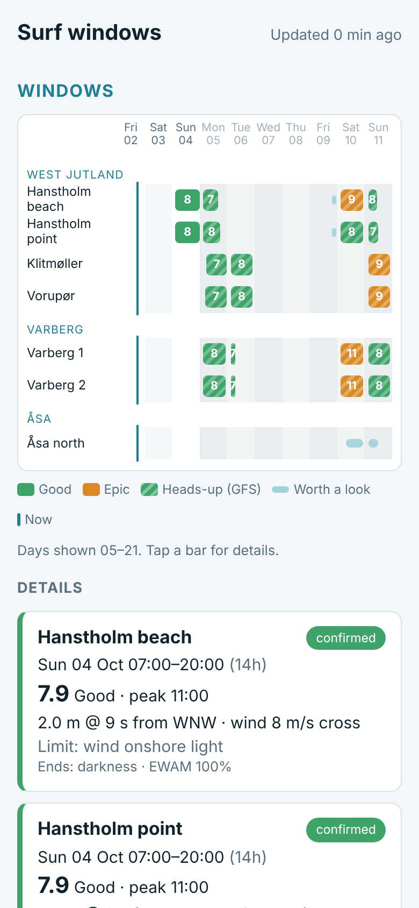
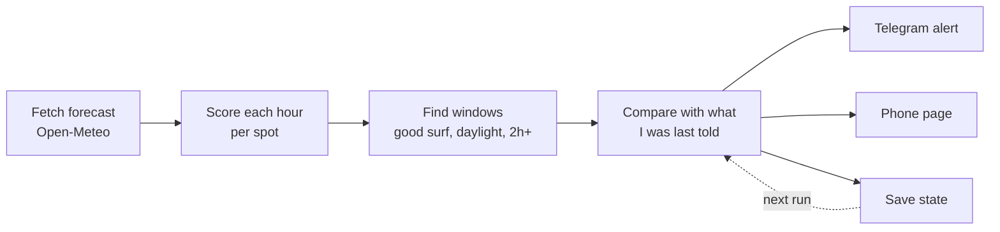

# Surf forecasting

**A small automated system that tells me when it's worth driving to the coast to surf.**

I live in Copenhagen. The surf here is rare and short-lived, and the spots are spread across Denmark and Sweden, some of them hours away by car. Checking forecast sites every day is slow, and they don't know which conditions actually work at each break. So I built a tool that checks for me twice a day and only sends me a message when something changes.

**Live page:** [jallen1998.github.io/surf-forecasting](https://jallen1998.github.io/surf-forecasting/)

<p align="center">
  
  &nbsp;&nbsp;
  
</p>

## What it does

- **Scores every hour at every spot** for the next 10 days, using free forecast data.
- **Finds "windows"**: stretches of at least 2 hours of good surf in daylight.
- **Sends me one Telegram message** when a window appears, gets more certain, gets better or worse, moves, or disappears. If nothing new has happened, it says nothing.
- **Builds a phone page** with the full picture: a timeline of windows, the reason behind each score, and a 10-day outlook. I keep it pinned to my home screen.
- **Sends a weekly summary** every Sunday, even when the week looks flat.

It runs by itself on GitHub Actions at about 07:00 and 19:00. I don't touch it.

## How it works



1. **Fetch** (`R/fetch_forecast.R`). Wave and wind forecasts for 13 spots from the Open-Meteo API.
2. **Score** (`R/score_block.R`). Each hour gets a score:

   > score = swell quality × direction exposure × wind effect

   *Swell quality* mixes wave period (65%) and height (35%), because period says more about quality. *Direction exposure* drops to zero when the swell comes from a direction the beach can't see. *Wind effect* rewards offshore wind and punishes onshore wind. Each score also records its **limiting factor**, so I can see *why* a day looks bad (e.g. "wind onshore", "period too short").
3. **Find windows** (`R/detect_windows.R`). Join good hours into sessions.
4. **Track** (`R/track_windows.R`). Match today's windows with the ones saved from earlier runs and decide what's actually news.
5. **Notify and publish** (`R/notify.R`, `R/render_page.R`, `R/digest.R`).

Spots, scoring thresholds and window rules all live in plain YAML files in `config/`, not in the code.

## Design choices I'm happy with

**Use the best model, but say which one.** A detailed European wave model (DWD EWAM) only covers about 3 days ahead, so after that I fall back to a coarser global model (NOAA GFS Wave). Every hour records which model it came from. Windows mostly based on the global model are marked as a *heads-up*. Once most of the hours come from the detailed model, the window is *confirmed*. I treat a heads-up very differently from a confirmed window.

**Only alert on real news.** Forecasts wobble every run. If the tool compared each run with the last one, I'd get a message every 12 hours about nothing. Instead it compares each window with **what it last told me**. A window that drifts a bit, or vanishes for one run and comes back the same, sends nothing.

**Don't let one bad hour split a session.** A window opens when the score reaches "good" (6), but only closes when it drops below 5. Short dips of an hour are bridged. Without this, a score bouncing around 6.0 would turn one session into three alerts.

**Fail loudly.** A broken pipeline looks exactly like "no surf this week". So if any step fails I get a "run FAILED" message with a link to the log, and the phone page shows a warning if the data is more than 14 hours old.

**Tests run before anything is sent.** There are 7 test files (about 110 checks) covering scoring, window detection, tracking and message formatting. If one fails, the run stops before it can send a wrong alert.

**Check that the data is real.** Open-Meteo's automatic model choice sometimes returns a successful response where every wave value is empty, for some coastal points ([issue #1364](https://github.com/open-meteo/open-meteo/issues/1364)). So I ask for specific models by name and check that real numbers came back before using them.

## What's still rough

- **Some inputs are my estimates.** Which way each beach faces, and which wind directions are offshore there, are judgement calls for several spots. The wind multipliers are educated guesses too. I log real sessions against the forecast in `log/recalibration_log.csv` and adjust from that, not from looking at one forecast.
- **Five spots are still missing** (Nakkehoved, Hundested, Vik/Kivik, Åhus, Ystad).
- **Long-range watching isn't built yet.** I'd like an early warning for big North Sea storms 7–15 days out, which would need ensemble forecasts.
- **Logging sessions is clunky** (editing a CSV). I plan to let myself log a session by replying to the Telegram bot.

## How I built it

I designed the system, chose the spots and set the scoring rules from my own surfing on these coasts. I wrote the code with Claude (Anthropic's AI assistant) as a pair programmer: I described how each step should behave, then reviewed, tested and changed what it wrote. The design decisions and their trade-offs are mine.

## Run it yourself

You need R and a Telegram bot.

```r
install.packages(c("httr", "jsonlite", "dplyr", "yaml", "purrr", "tibble"))
```

```bash
# Tests
for t in tests/test_*.R; do Rscript "$t"; done

# Dry run: prints the message it would send. Sends nothing, changes nothing.
Rscript run_daily.R --dry-run
Rscript run_daily.R --dry-run --page     # also writes a page preview to scratch/preview.html
Rscript run_daily.R --dry-run --digest   # also prints this week's summary
```

To send real alerts, put `TELEGRAM_BOT_TOKEN` and `TELEGRAM_CHAT_ID` in a `.Renviron` file (it's gitignored), or in the repository's Actions secrets for the scheduled runs. To use your own spots, edit `config/spots.yaml`.

## Built with

R · Open-Meteo Marine and Weather APIs · GitHub Actions · GitHub Pages · Telegram Bot API

## License

MIT
